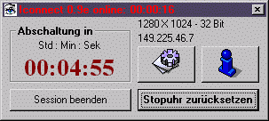



## IConnect

### Description

Iconnect as a highly cusomizable IP-Publisher; it can be used to: optimize remote-control connections (even via modem) to your computer, launch your webserver (or other programs) and shutdown your system after disconnect (if you want).
 
### More Info
 
an ftp-account

a html-page with your IP

may screw up screen colours when you change color resolution without rebooting. But then, it´s the only app here that can do that at all.

             |
---                |---
**Submitted On**   |2000-12-17 10:02:00
**By**             |[Thomas Sturm](https://github.com/Planet-Source-Code/PSCIndex/blob/master/ByAuthor/thomas-sturm.md)
**Level**          |Advanced
**User Rating**    |4.8 (19 globes from 4 users)
**Compatibility**  |VB 4\.0 \(32\-bit\), VB 5\.0, VB 6\.0
**Category**       |[Complete Applications](https://github.com/Planet-Source-Code/PSCIndex/blob/master/ByCategory/complete-applications__1-27.md)
**World**          |[Visual Basic](https://github.com/Planet-Source-Code/PSCIndex/blob/master/ByWorld/visual-basic.md)
**Archive File**   |[CODE\_UPLOAD1277212172000\.zip](https://github.com/Planet-Source-Code/thomas-sturm-iconnect__1-13661/archive/master.zip)

